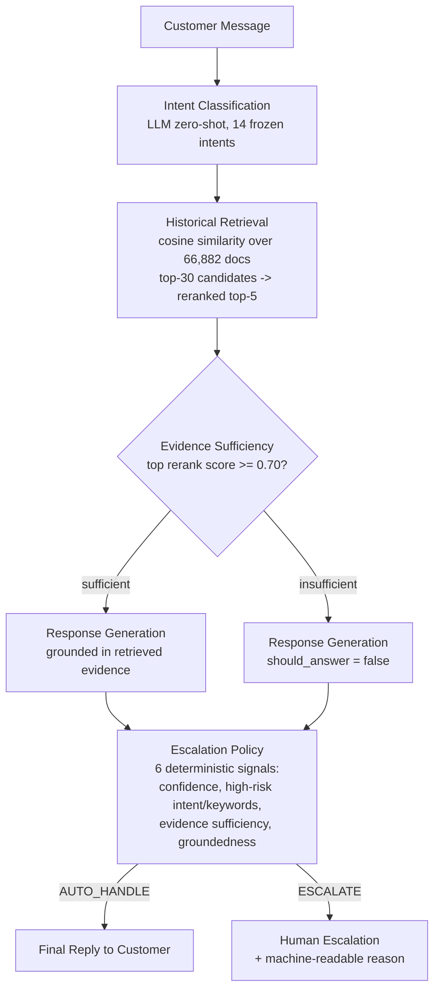
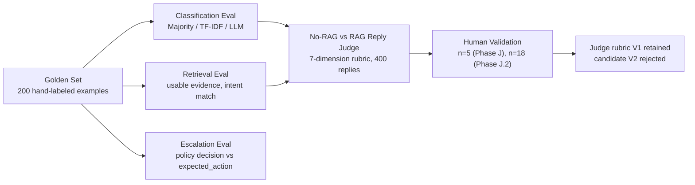

# AI Customer Support Agent

An evaluation-focused ML engineering project: an intent classification →
historical-retrieval (RAG) → grounded-generation → deterministic-escalation
pipeline built and rigorously evaluated for **AppleSupport**, one brand
from Kaggle's Customer Support on Twitter dataset. This is not a chatbot
demo — every claim in this README traces to a frozen, hash-verified
evaluation artifact under [`evaluation/results/`](evaluation/results/) and
[`reports/`](reports/). See [`reports/final_report.md`](reports/final_report.md)
for the full writeup and [`reports/decision_log.md`](reports/decision_log.md)
for the reasoning behind every non-obvious design choice.

## 1. Problem Statement

Brand support teams on Twitter handle a high volume of recurring,
formulaic issues (update complaints, connectivity problems, account
questions) alongside a smaller number of genuinely sensitive or novel
cases that require a human. The goal of this project is to build and
*prove the trustworthiness of* a system that: (a) understands what a
customer is asking, (b) grounds its answer in how similar issues were
actually resolved historically rather than free-generating an answer, and
(c) knows when **not** to answer — deferring to a human with an explicit,
auditable reason rather than guessing. The project is explicitly
evaluation-first: no metric is reported without a frozen artifact behind
it, and every optimistic-looking intermediate result (RAG's raw score,
the LLM judge's apparent reliability, a candidate rubric fix) was
independently interrogated rather than accepted at face value.

## 2. What the System Does

- **Intent classification** — a zero-shot LLM call (`gemini-3.5-flash-lite`,
  temperature 0.0) reads the customer's message plus prior conversation
  context and returns a structured `{intent, confidence, reason}` JSON
  object, classifying into one of 14 frozen, brand-derived intents.
- **Historical-response retrieval** — the customer's message is embedded
  and compared (cosine similarity) against a corpus of 66,882 historical
  AppleSupport resolution documents, returning the top candidates reranked
  by similarity, intent match, and resolution quality.
- **Evidence sufficiency gating** — the top reranked candidate's score is
  checked against a fixed threshold (0.70); if no candidate clears it,
  generation is told there is insufficient evidence, rather than being
  handed weak or irrelevant "evidence" to work with.
- **Grounded response generation** — an LLM drafts a customer-facing reply
  using only the retrieved evidence actually offered to it, explicitly
  instructed not to invent policies, refunds, deadlines, or actions not
  supported by evidence, and to decline (empty reply, `should_answer=false`)
  rather than guess when evidence is thin.
- **Escalation decision** — a separate, deterministic (non-LLM) policy
  combines six signals (high-risk intent, high-risk/hardware/billing/
  data-loss keywords, insufficient retrieval evidence, an ungrounded
  generation, and classifier confidence below 0.75) into an
  `AUTO_HANDLE` / `ESCALATE` decision with a machine-readable reason —
  the LLM is never allowed to decide escalation itself.
- **Human handoff** — an `ESCALATE` decision routes the case to a human
  agent with the classified intent, retrieved evidence, and the specific
  triggering reason attached, rather than a silent drop or a forced
  auto-reply.

## 3. Architecture



*Note: the escalation policy is evaluated last, not mid-pipeline — two of
its six signals (`insufficient_historical_evidence`,
`generation_could_not_be_grounded`) are only known once retrieval and
generation have run, so it necessarily combines classification, retrieval,
and generation signals together rather than gating between them.*

The **evaluation pipeline** (used to produce every number in Section 7) is
separate from the agent pipeline above — it doesn't run at inference time:



## 4. Dataset

Source: Kaggle `thoughtvector/customer-support-on-twitter`
(2,811,774 tweets, ~108 brands). **AppleSupport** was selected over
higher-volume alternatives (e.g. AmazonHelp) on measured evidence, not
brand recognition: comparable usable-conversation volume (80,627 vs
82,489), a higher "resolved-ish" rate (89.7% vs 79.0%), 0% detected
non-English markers vs 3.7%+ for AmazonHelp, and a single coherent
product domain versus Amazon's mixed retail/streaming/cloud scope (full
reasoning in `reports/decision_log.md` entry #1). This project does
**not** claim byte-level equivalence with the original Kaggle CSV — only
that the brand-selection numbers above were computed from it.

80,503 conversations were reconstructed from raw tweets using
identity-aware BFS (not naive connected-components, which would merge
unrelated customers through a shared agent-reply hub — decision log #2).
Conversations were split **temporally**, at the conversation level, into
`retrieval_pool` (68,427 conversations) and `eval_pool` (12,076
conversations) at `2017-11-21T07:55:44Z`, so every evaluation conversation
follows every retrieval/training conversation in time. The 200-example
golden set is drawn only from `eval_pool`; conversation-ID and tweet-ID
overlap between golden and `retrieval_pool`/training data was checked and
confirmed to be **0** at every join point, most recently in a full
repository audit (`reports/final_audit_checklist.md`).

## 5. Intent Taxonomy

The system uses **14 frozen intents**, derived from KMeans clustering
(k=25) over 12,000 sampled `retrieval_pool` messages followed by manual
curation (full methodology in `reports/intent_discovery.md`; canonical
definitions in [`config/intents.yaml`](config/intents.yaml)):

1. `ios_update_general_complaint` — general "something got worse after an update" complaints with no specific symptom
2. `autocorrect_keyboard_bug` — the iOS 11.1-era "types a box/question mark instead of I" bug
3. `battery_life_drain` — unusually fast battery drain or charging problems
4. `device_freezing_performance` — device freezing, hanging, or requiring a restart
5. `connectivity_network_messaging_issues` — WiFi/Bluetooth/cellular/iMessage/notification problems
6. `audio_accessory_issues` — EarPods/AirPods/speaker/headphone-jack problems
7. `media_music_playback_issues` — Apple Music/iTunes/Podcasts playback, sync, or subscription issues
8. `app_store_purchase_issues` — App Store download/update/in-app-purchase billing problems
9. `photos_storage_icloud_management` — Photos app, iCloud Photo Library, or storage management
10. `account_apple_id_security` — Apple ID/iCloud login, password resets, phishing reports
11. `mac_macos_issues` — Mac hardware or macOS software problems
12. `apple_watch_issues` — Apple Watch hardware, watchOS, or pairing problems
13. `order_purchase_retail_support` — order status, warranty/AppleCare, retail purchase issues
14. `vague_frustration_needs_clarification` — generic frustration with no actionable content yet

Each intent's full definition includes examples, confusable-intent pairs,
and explicit escalation guidance in `config/intents.yaml`.

## 6. Evaluation Methodology

All results are measured against a **200-example golden set**
(`data/golden/golden_200.jsonl`), stratified across natural intent
distribution, rare intents, and deliberately difficult/ambiguous
examples, hand-labeled by reading each conversation (never generated by
any classifier). Leakage was checked at every join point — golden
conversation/tweet IDs never appear in `retrieval_pool` or in any
training data, and the RAG corpus additionally excludes any document
whose text exactly matched a golden example (`reports/rag_leakage_check.md`,
`reports/leakage_check.md`).

Five systems/layers are evaluated, each measuring something different:

1. **Majority-class baseline** — every input gets the most frequent
   intent (`src/classification/majority.py`).
2. **TF-IDF + Logistic Regression baseline** — trained on
   `retrieval_pool`-only pseudo-labels, never on golden
   (`src/classification/tfidf_baseline.py`).
3. **LLM intent classifier** — the zero-shot classifier described in
   Section 2 (`src/classification/llm_classifier.py`).
4. **Retrieval ablation (No-RAG vs RAG)** — the same generation prompt/
   model/temperature run once with an empty evidence list and once with
   real retrieved evidence, judged by a 7-dimension LLM rubric that was
   itself audited and validated against genuine human ratings before
   being trusted (`reports/judge_rubric_audit.md`,
   `reports/judge_human_validation_v2.md`).
5. **Escalation policy** — the deterministic policy's `AUTO_HANDLE`/
   `ESCALATE` decision compared against each golden example's hand-labeled
   `expected_action` (`src/escalation/policy.py`, `evaluation/run_escalation.py`).

**Retrieval metrics and reply-quality metrics measure different things
and are never conflated in this project:** retrieval metrics (usable
evidence rate, intent match rate) describe whether relevant historical
text was *found*; reply-quality metrics (the No-RAG vs RAG judge scores)
describe whether the *generated reply* was good. A high retrieval score
does not imply a high reply score, and Section 8 of `reports/final_report.md`
documents exactly why they diverge here.

## 7. Results

| Component | Metric | Value | What it measures |
|---|---|---:|---|
| Classification | LLM accuracy | **83.0%** | Intent correctness on 200 golden examples |
| Classification | Macro F1 | **0.830** | Same task, class-balanced |
| Classification | Weighted F1 | **0.831** | Same task, frequency-weighted |
| Retrieval | Usable evidence | **80.0%** | Whether relevant historical text was found — **not reply quality** |
| Retrieval | Top-1 intent match | **98.125%** | Whether the top retrieved document's tagged intent matches the predicted intent |
| Retrieval | Top-1 substantive retrieved response | **95.0%** | Whether the top retrieved document itself passed a substantive-content heuristic |
| Escalation | Accuracy | **75.0%** | Policy decision correctness vs golden `expected_action` |
| Escalation | ESCALATE recall | **77.3%** | Share of true escalation cases the policy actually caught |
| Escalation | False-auto (unsafe) | **10 / 200** | Cases the policy wrongly auto-handled |
| Escalation | False-escalate (over-cautious) | **40 / 200** | Cases the policy escalated unnecessarily |
| Reply evaluation | No-RAG mean (judge) | **4.70 / 5** | LLM-judged reply quality with no retrieved evidence |
| Reply evaluation | RAG mean (judge) | **4.386 / 5** | LLM-judged reply quality with retrieved evidence |
| Reply evaluation | RAG better | **7 / 200** | Paired comparison, ±0.30 equivalence margin |
| Reply evaluation | No-RAG better | **48 / 200** | Paired comparison, ±0.30 equivalence margin |
| Reply evaluation | Equivalent | **145 / 200** | Paired comparison, ±0.30 equivalence margin |

**These five groups evaluate five different layers of the system and must
not be read as one overall "agent accuracy."** A correct intent can still
retrieve poor evidence; good evidence can still generate an ungrounded
reply; a good reply can still be mis-escalated. Section 10 below expands
on why no single number here should stand in for the whole system.

## 8. Key Findings

- **The LLM classifier substantially outperformed the classical
  baselines** — 83.0% accuracy / 0.830 macro F1 vs the majority baseline's
  0.020 macro F1 and TF-IDF's 0.579 (message-only) / 0.600 (with context)
  macro F1.
- **Retrieval usually found relevant historical evidence** — 80.0% of
  golden queries cleared the evidence-sufficiency threshold, with 98.125%
  top-1 intent match among what was retrieved.
- **Retrieval evidence quality did not automatically translate into
  better generated replies.** RAG's raw judge mean (4.386) is lower than
  No-RAG's (4.70), which on its own looks like a regression.
- **Insufficient-evidence cases are the actual driver of that gap, not
  worse answers overall.** When evidence was sufficient (80% of cases),
  RAG was essentially even with No-RAG (mean diff +0.113); the entire
  headline deficit concentrates in the 20% of cases where RAG correctly
  declined rather than guessed, a decision the judge's own rubric
  penalizes for producing no text — independent of whether declining was
  the right call.
- **The escalation policy deliberately favored safety recall over
  minimizing false escalations.** The single best raw-accuracy
  configuration tested (84.0%) was explicitly rejected because it doubled
  unsafe false-auto-handles (20/200 vs the adopted policy's 10/200) —
  accuracy was never the optimization target.
- **The judge rubric was empirically audited rather than blindly
  trusted.** A category-error in the original rubric (scoring every
  intentionally empty RAG decline as "unprofessional") led to a candidate
  fix (V2), which was then tested against genuine human ratings on
  refusal cases and found to move *further* from human judgment than the
  original rubric (MAE 2.531 vs 1.714) — V2 was rejected and V1 remains
  the frozen, official rubric.

## 9. Failure Analysis

- **Connectivity/network vocabulary confusion** — the LLM classifier's
  single largest confusion pattern: `ios_update_general_complaint` →
  `connectivity_network_messaging_issues` (7 golden cases), where
  network-adjacent words (service, WiFi, contacts, GPS) pull the
  classifier toward the connectivity intent even when the human labeler
  judged the message too generic or multi-part to commit to that reading.
- **Update/install vs App Store confusion** — messages about failed OS
  updates that also mention installation/download mechanics pull toward
  `app_store_purchase_issues` (4 golden cases) — a genuine, documented
  confusable pair, not a random error.
- **Taxonomy coverage gaps** — 14/200 (7%) golden examples surfaced
  requests with no clean matching intent (contacts sync, camera-app
  quality, Siri personalization) — deliberately not patched into a 15th
  intent absent stronger frequency evidence.
- **Insufficient historical precedents** — 22.5% of insufficient-evidence
  retrieval cases are legitimately rare/institutional requests (B2B
  procurement, enterprise RAID support) with no comparable historical
  case in the corpus.
- **Excessive refusal behavior** — RAG's dominant failure mode: 42/200
  declines under thin evidence. A designed behavior, not a bug, but one
  whose customer-facing cost is directly visible in the judge scores
  (Section 8).
- **Isolated hallucination** — across all 400 judged replies, exactly 1
  confirmed hallucination (a No-RAG reply recommending "App Library," a
  feature that didn't exist on the customer's stated iOS version),
  correctly caught by the judge.
- **Evidence mismatch (intent-tag mismatch)** — 62.5% of insufficient-evidence
  retrieval cases fail because the top candidate's *tagged* intent
  doesn't match the *predicted* intent despite genuinely relevant text
  (similarity 0.52–0.91) — an upstream classification error compounding
  into a retrieval rejection, not a retrieval defect per se.
- **Escalation false positives/negatives** — all 10 remaining
  false-auto-handle cases shared high confidence, retrieved evidence, and
  a generated reply — none were catchable by confidence alone. High-risk
  intents escalate unconditionally, at a measured cost of 9/40
  false-escalates.
- **Judge refusal-scoring problem** — the original rubric (V1) scored
  every intentionally empty RAG decline as "unprofessional," a category
  error. The candidate fix (V2) was rejected after human validation
  showed it moved further from human judgment than V1 on the exact cases
  it targeted (Section 8).

## 10. What Is Misleading About the Headline Number?

Take **"83.0% classifier accuracy"** as the example. This does **not**
mean "the complete support agent is 83% accurate":

- **It is 83% on a finite 200-example golden benchmark, not production
  accuracy.** A different 200-example draw from the same eval pool would
  plausibly land within a few points of 83%, not exactly at it.
- **Class imbalance makes macro F1, not raw accuracy, the load-bearing
  number** — a constant-output majority classifier already scores
  non-trivially by volume alone; macro F1 (also 0.830 here, a coincidence
  of this run) is what actually confirms rare intents work, not just the
  head of the distribution.
- **Classification, retrieval, generation, and escalation are four
  separate system layers, each with its own metric** — 83.0% describes
  only the first. It says nothing about retrieval quality (80.0%/98.125%/
  95.0%), reply quality (4.70/4.386), or escalation safety (10 false-auto/
  40 false-escalate).
- **The classical baselines were trained on pseudo-labels, not human
  labels** — TF-IDF's ~58–60% macro F1 bounds what lexical features can
  recover from a classifier-generated training signal, not from ground
  truth, so it is a directional comparison point, not a clean
  apples-to-apples baseline.
- **Retrieval success is not response correctness.** 80% "usable
  evidence" and the 98.125%/95.0% retrieval metrics describe whether
  plausible historical text was found — not whether the generated reply
  was good, safe, or preferred by a human.
- **The LLM judge is not human ground truth.** The only genuine human
  evidence available (n=5 in Phase J, n=18 in Phase J.2, single rater
  both times) showed weak-to-negative correlation with the judge on the
  first small sample and a large, directionally consistent gap on
  refusal cases in the second — the judge is used because a larger human
  study was not feasible in this project's scope, not because it was
  validated as reliable.
- **Human validation throughout is small and single-rater** — precise
  language ("a single human rater on N examples") is used everywhere this
  is cited, never "human-validated" or "multi-rater validated" as a
  blanket claim.
- **Known taxonomy gaps exist** — 7% of golden examples matched no intent
  cleanly; accuracy is computed only over the 14 defined intents and says
  nothing about genuinely out-of-taxonomy requests.

This is a **strong, credible result within its stated scope** — the
bounds above define that scope precisely, not undermine the result. Full
discussion: `reports/final_report.md` Section 9.

## 11. Reproducibility

Requires **Python 3.12**. Install dependencies:

```bash
pip install -r requirements.txt
```

Copy `.env.example` to `.env` and fill in `LLM_PROVIDER` / `LLM_MODEL` /
`LLM_API_KEY` (never commit `.env` — it is git-ignored). The core pipeline
is reproducible via the commands already used to produce every result in
this README:

```bash
python -m src.analysis.brand_analysis
python -m src.ingestion.reconstruct_threads
python -m evaluation.run_baselines
python -m evaluation.run_llm_classifier
python -m evaluation.run_rag
python -m evaluation.run_escalation
python -m evaluation.run_reply_judge
```

Every LLM call (classification, generation, judging) is cached by a hash
of its exact prompt under `data/processed/`, so re-running after an
interruption only retries genuinely missing/failed examples — it never
re-does completed work or re-charges API quota. All project random seeds
are fixed and documented in-source: `42` (TF-IDF/KMeans/sampling
conventions), `1234` (RAG dev-holdout, deliberately distinct), and
`20260910`/`20260911`/`20260912` (human-study selection and bootstrap
seeds for Phases J/J.1/J.2).

Configuration is split by ownership: [`config/rag.yaml`](config/rag.yaml)
owns retrieval settings, [`config/escalation.yaml`](config/escalation.yaml)
owns escalation signals/thresholds, [`config/intents.yaml`](config/intents.yaml)
owns the intent taxonomy, and [`config/config.yaml`](config/config.yaml)
holds brand/data-path/evaluation-settings documentation (see that file's
own header comment for which fields are load-bearing vs. reference-only).
Frozen evaluation artifacts live under `evaluation/results/` (regenerated,
not hand-edited) and are the source of truth for every number in this
README.

## 12. Run a Single Customer Message

The commands in Section 11 run the frozen, 200-example golden-set
evaluation. For a genuinely new message outside that set — a live demo,
not an evaluation — use [`src/agent.py`](src/agent.py)'s `run_agent()` via
the CLI at [`scripts/run_agent.py`](scripts/run_agent.py). This is a
**minimal end-to-end inference/demo entry point**, not a production
service (see `reports/decision_log.md`'s entry on why it was added and
what it deliberately does not include).

**Prerequisites:** the same as Section 11 — `pip install -r requirements.txt`,
and `.env` filled in with `LLM_PROVIDER` / `LLM_MODEL` / `LLM_API_KEY`
(copy from `.env.example`; never commit `.env`). The retrieval corpus/index
cache under `data/processed/` must already exist (it does after any prior
run of `evaluation.run_rag`, or `python -c "from src.retrieval.index import build_index; build_index()"`
to build it standalone).

**Exact command:**

```bash
python scripts/run_agent.py "My iPhone battery is draining really fast after the latest update. What should I do?"
```

**Example output** (abridged; full retrieved-evidence text and the raw
JSON form are both available via `--json`):

```
-- Classification --
  intent:             battery_life_drain
  confidence:         0.95 (self_reported, NOT calibrated)

-- Retrieval --
  evidence_sufficient: True (threshold=0.7)
  retrieved_evidence (5): [historical similar cases, similarity 0.80-0.84]

-- Generation --
  should_answer:   True
  reply:           "We'd be glad to look into this with you. To get
                    started, send us a DM with which version of iOS you
                    have installed and we'll work from there: ..."

-- Escalation --
  action:  AUTO_HANDLE
  reasons: []
```

**Reading the output:** `intent`/`confidence` come from the same zero-shot
LLM classifier as Section 7's headline numbers; `retrieved_evidence` is
whatever the same retrieval+rerank pipeline actually found for *this*
message (empty if nothing cleared the 0.70 evidence threshold); `reply` is
what generation drafted, grounded only in that evidence; `action` is the
unmodified escalation policy's decision. **If `action` is `ESCALATE`, the
drafted `reply` was NOT sent to the customer automatically** — the CLI
prints an explicit note to this effect, and the returned dict's
`send_automatically` field is `False` in that case. Add `--json` for the
raw structured result, or `--conversation-json '[{"speaker":"customer","text":"..."}]'`
to supply prior conversation turns.

## 13. Repository Structure

```
.
├── README.md
├── CLAUDE.md
├── requirements.txt
├── .env.example
├── .gitignore
│
├── config/
│   ├── config.yaml               # brand / data-path / eval-setting documentation
│   ├── intents.yaml               # 14 frozen intents (Section 5)
│   ├── rag.yaml                   # retrieval config (owns top_k, embedding model, thresholds)
│   ├── escalation.yaml            # escalation policy config (owns signals/thresholds)
│   ├── escalation_candidates.yaml # Phase I.1 candidate-policy experiment record
│   ├── judge_rubric.yaml          # frozen LLM-judge rubric (V1, official)
│   ├── judge_rubric_v2.yaml       # candidate rubric fix (audited, rejected)
│   └── llm_classifier.yaml
│
├── data/
│   ├── README.md                  # dataset acquisition instructions
│   ├── raw/twcs.csv               # not committed — see data/README.md
│   ├── processed/                 # reconstructed conversations, corpus, embeddings (regenerated)
│   ├── golden/golden_200.jsonl    # 200-example hand-labeled evaluation set
│   └── evaluation/                # human rating study files (genuine + simulated, kept separate)
│
├── src/
│   ├── agent.py                   # single-message inference orchestration (Section 12) -- demo only
│   ├── analysis/                  # brand analysis, intent discovery/coverage
│   ├── ingestion/                 # conversation reconstruction
│   ├── classification/            # majority / TF-IDF / LLM classifiers, provider adapters
│   ├── retrieval/                 # embedding index, reranking, evidence gating, PII sanitization
│   ├── generation/                # grounded reply generation
│   ├── escalation/                # deterministic escalation policy
│   └── evaluation/                # leakage checks, judge prompts/runners, human-study tooling
│
├── scripts/
│   └── run_agent.py               # CLI for src/agent.py (Section 12)
│
├── evaluation/
│   ├── run_baselines.py
│   ├── run_llm_classifier.py
│   ├── run_rag.py
│   ├── run_escalation.py
│   ├── run_escalation_candidates.py   # Phase I.1 experiment
│   ├── run_reply_judge.py
│   ├── run_rubric_audit.py            # Phase J.1 rubric audit
│   └── results/                       # frozen JSON/JSONL evaluation outputs (regenerated)
│
├── tests/
│   └── test_agent.py              # unit tests for src/agent.py's orchestration (mocked LLM calls)
│
└── reports/
    ├── final_report.md            # full 12-section technical writeup
    ├── final_audit_checklist.md   # Phase K integrity/leakage/security/metric audit
    ├── decision_log.md            # every non-obvious design decision, with reasoning/tradeoffs
    └── ...                        # per-phase detail reports (baselines, RAG, escalation, judge, etc.)
```

## 14. Limitations

- Corpus and golden set share a single historical time window (Oct–Dec
  2017) — the system cannot demonstrate resilience to an outdated
  historical response, in either direction, because that failure mode has
  no opportunity to manifest in this data.
- Resolution-quality and PII-sanitization are cheap heuristics, not
  LLM-judged or NER-based.
- Reranking weights and retrieval/escalation thresholds were each chosen
  once from held-out dev data, never systematically grid-searched.
- The reply-quality judge shares its underlying model with the reply
  generator — a possible self-preference bias, untested in this project.
- Human validation of the LLM judge is small and single-rater throughout
  (5 examples in Phase J, 18 in Phase J.2) — reported as inconclusive-to-negative
  evidence, never presented as validation.
- Self-reported classifier confidence is analyzed (Pearson r=0.424 with
  correctness) but not calibrated — no calibration curve or
  temperature-scaling was fit.
- The intent taxonomy has a measured coverage gap (7% of golden examples,
  14/200) for requests with no clean matching intent.

## 15. Conclusion

This project demonstrates a working, evaluation-first pipeline in which
every headline number traces to a frozen, hash-verified artifact, and in
which optimistic-looking intermediate results were interrogated rather
than accepted — twice (RAG's raw judge deficit, the candidate judge-rubric
fix) that scrutiny produced a corrected or negative conclusion rather than
a favorable one. It does **not** demonstrate a single "overall accuracy"
for the agent (classification, retrieval, generation, and escalation are
measured and reported separately, deliberately never averaged into one
number), production-scale reliability (finite 200-example benchmark, one
3-month data window), a validated LLM judge (only small, single-rater
human evidence exists), or a calibrated confidence signal. Within those
explicitly stated bounds, the results are genuine and reproducible from
the commands in Section 11.
